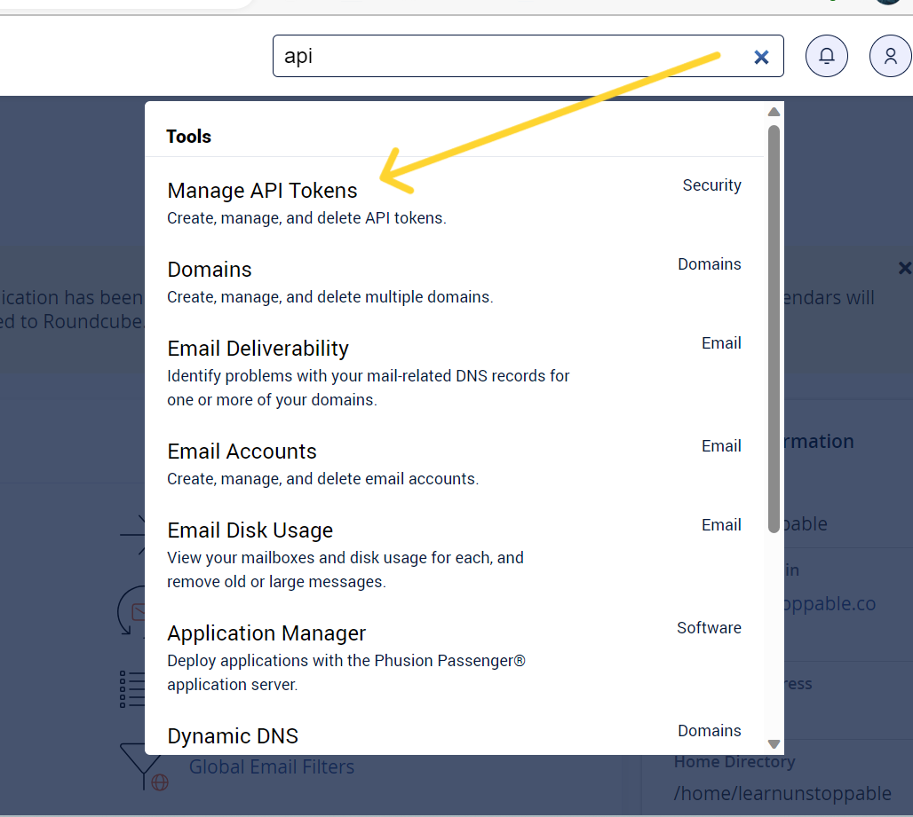
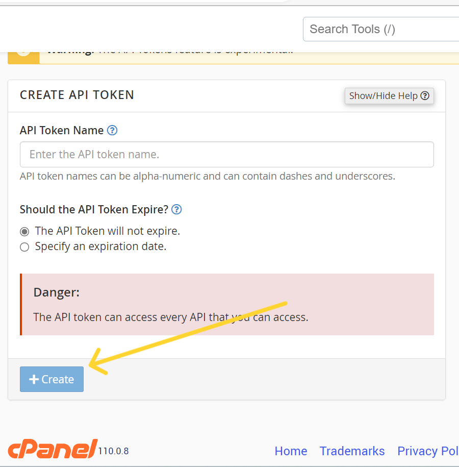

[](https://github.com/MHasnainJafri/cpanel/blob/master/LICENSE)
<!-- [](https://github.com/MHasnainJafri/cpanel/releases) -->
[](https://github.com/MHasnainJafri/cpanel/issues)
[](https://github.com/MHasnainJafri/cpanel/stargazers)
[](https://github.com/MHasnainJafri/cpanel/network/members)

Library Name: Laravel CPanel API

This library provides a convenient way to interact with the cPanel API using Laravel. It allows you to perform various cPanel functions such as creating subdomains, managing databases, handling email accounts, and managing disk usage.

Installation

To use this library in your Laravel project, you can install it via Composer. Run the following command in your terminal:

```

composer require mhasnainjafri/cpanel

```
### Usage

To get started, you need to create a new instance of the Cpanel class. There are two ways to initialize the class:

1. Without any parameters:
```php
$cpanel = new Cpanel();
```
2. With parameters (if not defined in `.env` file):
```php
$cpanel = new Cpanel($cpanel_domain, $cpanel_api_token, $cpanel_username, 'https', 2083);
```
Alternatively, you can set the cPanel credentials in the `.env` file:
```
CPANEL_DOMAIN=domain e.g : xyz.com
CPANEL_PORT=cpanel port (mostly is) 2083
CPANEL_API_TOKEN= Cpanel api token (To get api token view step 3)
CPANEL_USERNAME= Cpanel username
```
3. ### Steps to get Cpanel Api 

- search api in cpanel search bar
- click on ```Manage api token```

- Give  token a name and click on create 

- Copy the token you get


### Subdomain Functions

To create a subdomain, use the `createSubDomain()` method:

```php

$cpanel->createSubDomain('Sub domain e.g: web', 'domain e.g: xyz.com', 'Path where subdomain points e.g: /home/domain/public_html/subdomain');

```

### Database Functions

To list all databases, use the `listDatabases()` method:

```php

$cpanel->listDatabases();

```

To create a new database, use the `createDatabase()` method:

```php

$cpanel->createDatabase('Database Name');

```

To delete a database, use the `deleteDatabase()` method:

```php

$cpanel->deleteDatabase('Database Name');

```

To create a database user, use the `createDatabaseUser()` method:

```php

$cpanel->createDatabaseUser('Database username', 'password');

```

To delete a database user, use the `deleteDatabaseUser()` method:

```php

$cpanel->deleteDatabaseUser('Database username');

```

To set all privileges on a database for a user, use the `setAllPrivilegesOnDatabase()` method:

```php

$cpanel->setAllPrivilegesOnDatabase('Database username', 'Database Name');

```

### Mail Functions

To create a POP email account, use the `createPopEmailAccount()` method:

```php

$cpanel->createPopEmailAccount('mail@domain.com', 'password');

```

To delete a POP email account, use the `deletePopEmailAccount()` method:

```php

$cpanel->deletePopEmailAccount('mail@domain.com');

```

To edit the mailbox quota for an email account, use the `editMailboxQuota()` method:

```php

$cpanel->editMailboxQuota($email, $domain, $quota);

```

To dispatch client settings for an email account, use the `dispatchClientSettings()` method:

```php

$cpanel->dispatchClientSettings('mail@domain.com', 'account');

```

To get the POP email count, use the `getPopEmailCount()` method:

```php

$cpanel->getPopEmailCount();

```

### cPanel Disk Management

To get cPanel statistics bar stats for bandwidth usage or disk usage, use the `getCpanelStatsBarStats()` method:

```php

$cpanel->getCpanelStatsBarStats('bandwidthusage|diskusage');

```

To get cPanel disk quota information, use the `getCpanelDiskQuotaInfo()` method:

```php

$cpanel->getCpanelDiskQuotaInfo();

```

### Other API Functions

To call any other cPanel API function, use the `callUAPI()` method:

```php

$cpanel->callUAPI($Module, $function, $parameters_array = array());

```

Replace `$Module` with the desired module, `$function` with the function name, and `$parameters_array` with any additional parameters required by the API function.

That's it! You can now leverage the power of the Laravel CPanel API library to interact with the cPanel API seamlessly in your Laravel applications.


### Testing

```bash
composer test
```

### Changelog

Please see [CHANGELOG](CHANGELOG.md) for more information what has changed recently.

## Contributing

Please see [CONTRIBUTING](CONTRIBUTING.md) for details.

### Security

If you discover any security related issues, please email mhasnainjafri0099@gmail.com instead of using the issue tracker.

## Credits

-   [Muhammad Hasnain](https://github.com/MHasnainJafri)


## License

The MIT License (MIT). Please see [License File](LICENSE.md) for more information.

## Laravel Package Boilerplate

This package was generated using the [Laravel Package Boilerplate](https://laravelpackageboilerplate.com).
